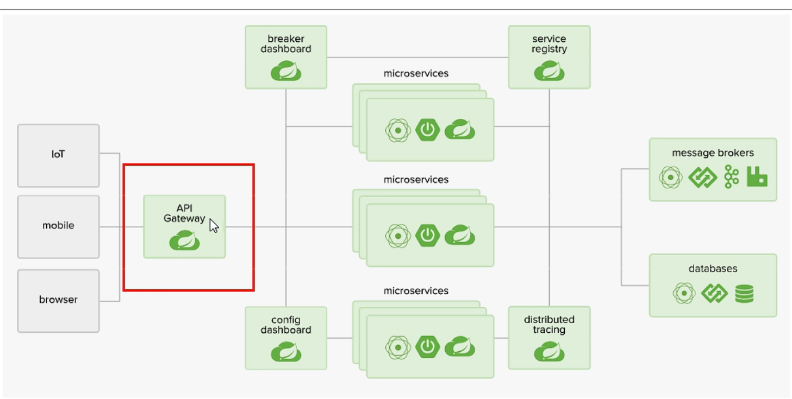
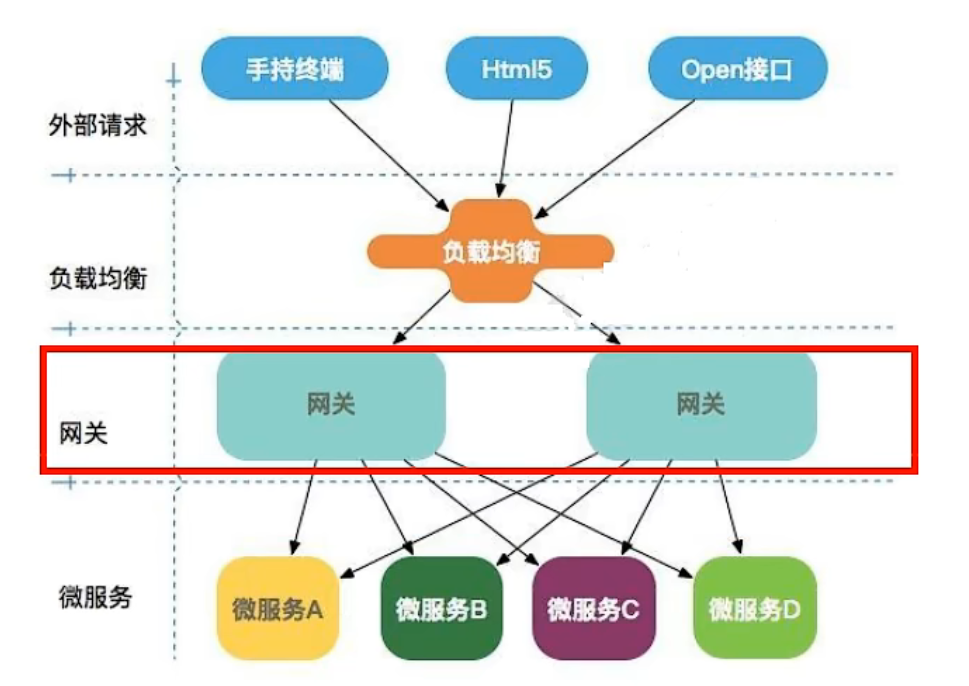
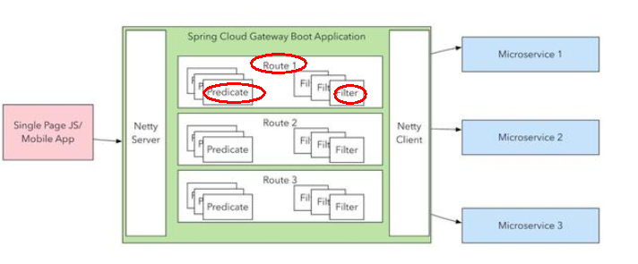
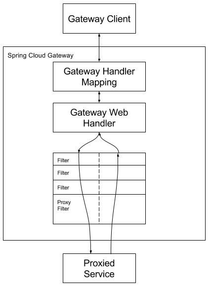
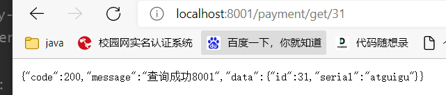
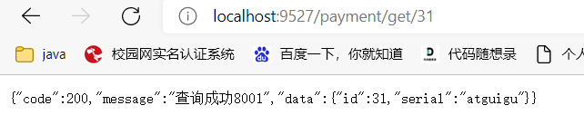
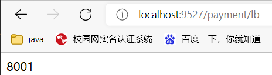
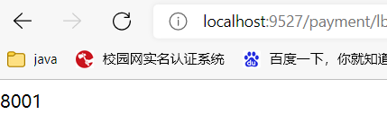
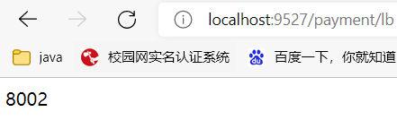

# Gateway简介
  
网关的位置      
  
* Gateway是在Spring生态系统之上构建的API网关服务，基于Spring 5，Spring Boot 2和 Project Reactor等技术。  
* Gateway旨在提供一种简单而有效的方式来对API进行路由，以及提供一些强大的过滤器功能， 例如：熔断、限流、重试等      
* SpringCloud Gateway 使用的Webflux中的reactor-netty响应式编程组件，底层使用了Netty通讯框架  
* Webflux是一个非阻塞的web框架，并且是异步的  


##### 三大核心概念  
###### Route(路由)  
路由是构建网关的基本模块，它由ID，目标URI，一系列的断言和过滤器组成，如果断言为true则匹配该路由
###### Predicate(断言)  
参考的是Java8的java.util.function.Predicate  
开发人员可以匹配HTTP请求中的所有内容(例如请求头或请求参数)，如果请求与断言相匹配则进行路由  
###### Filter(过滤)  
指的是Spring框架中GatewayFilter的实例，使用过滤器，可以在请求被路由前或者之后对请求进行修改。  

###### 总结

web请求，通过一些匹配条件，定位到真正的服务节点。并在这个转发过程的前后，进行一些精细化控制。  
predicate就是我们的匹配条件；而filter，就可以理解为一个无所不能的拦截器。有了这两个元素，再加上目标uri，就可以实现一个具体的路由了    

##### Gateway工作流程  
  


* 客户端向 Spring Cloud Gateway 发出请求。然后在 Gateway Handler Mapping 中找到与请求相匹配的路由，将其发送到 Gateway Web Handler。  
* Handler 再通过指定的过滤器链来将请求发送到我们实际的服务执行业务逻辑，然后返回。  
过滤器之间用虚线分开是因为过滤器可能会在发送代理请求之前（“pre”）或之后（“post”）执行业务逻辑。
* Filter在“pre”类型的过滤器可以做参数校验、权限校验、流量监控、日志输出、协议转换等，  
在“post”类型的过滤器中可以做响应内容、响应头的修改，日志的输出，流量监控等有着非常重要的作用。  


##### 网关类的application.yml配置文件  
``` yaml
server:
  port: 9527

spring:
  application:
    name: cloud-gateway

  cloud:
    gateway:
      routes:
        - id: payment_routh #payment_route    #路由的ID，没有固定规则但要求唯一，建议配合服务名
          uri: http://localhost:8001          #匹配后提供服务的路由地址
          predicates:
            - Path=/payment/get/**         # 断言，路径相匹配的进行路由

        - id: payment_routh2 #payment_route    #路由的ID，没有固定规则但要求唯一，建议配合服务名
          uri: http://localhost:8001          #匹配后提供服务的路由地址
          predicates:
            - Path=/payment/lb/**         # 断言，路径相匹配的进行路由

eureka:
  instance:
    hostname: cloud-gateway-service
  client: #服务提供者provider注册进eureka服务列表内
    service-url:
      register-with-eureka: true
      fetch-registry: true
      defaultZone: http://localhost:7001/eureka
```

参数说明: 
```yaml
  cloud:
    gateway:     #网关
      routes:    #路由
        - id: XXX #payment_route    #路由的ID，没有固定规则但要求唯一，建议配合服务名
          uri: http://localhost:XXXX          #匹配后提供服务的路由地址
          predicates:
            - Path=/XXX/XXX        # 断言，路径相匹配的进行路由
```
配置了uri后，当用户访问http://localhost:XXXX后，9527端口的网关会挡在他前面
没配置网关以前   
  
配置网关以后,能通过9527访问8001    
  
  

##### 动态路由  
```yaml
server:
  port: 9527

spring:
  application:
    name: cloud-gateway

  cloud:
    gateway:
      discovery:
        locator:
          enabled: true #开启从注册中心动态创建路由的功能，利用微服务名进行路由
      routes:
        - id: payment_routh #payment_route    #路由的ID，没有固定规则但要求唯一，建议配合服务名
          uri: lb://cloud-payment-service         #匹配后提供服务的路由地址
          predicates:
            - Path=/payment/get/**         # 断言，路径相匹配的进行路由

        - id: payment_routh2 #payment_route    #路由的ID，没有固定规则但要求唯一，建议配合服务名
          uri: lb://cloud-payment-service          #匹配后提供服务的路由地址
          predicates:
            - Path=/payment/lb/**         # 断言，路径相匹配的进行路由

eureka:
  instance:
    hostname: cloud-gateway-service
  client: #服务提供者provider注册进eureka服务列表内
    service-url:
      register-with-eureka: true
      fetch-registry: true
      defaultZone: http://localhost:7001/eureka
```
加了两个地方的配置,lb:负载均衡 load balancing
```yaml
      discovery:
        locator:
          enabled: true #开启从注册中心动态创建路由的功能，利用微服务名进行路由


      uri: lb://cloud-payment-service #匹配后提供服务的路由地址
```  
  
  
实现了网关层面服务的负载均衡  
